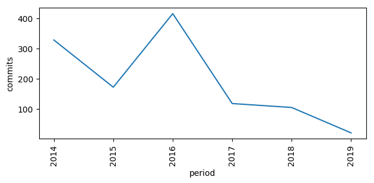
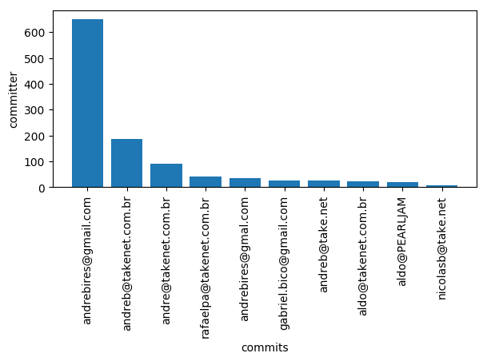
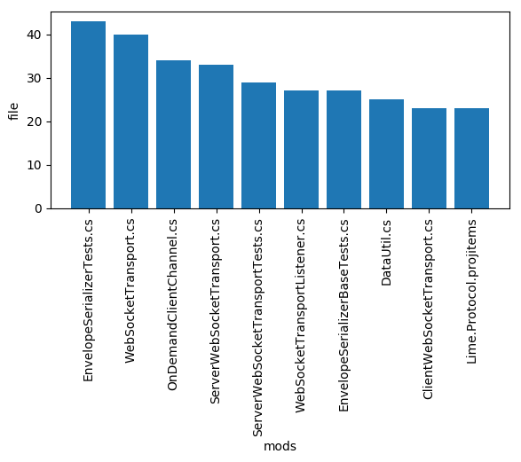
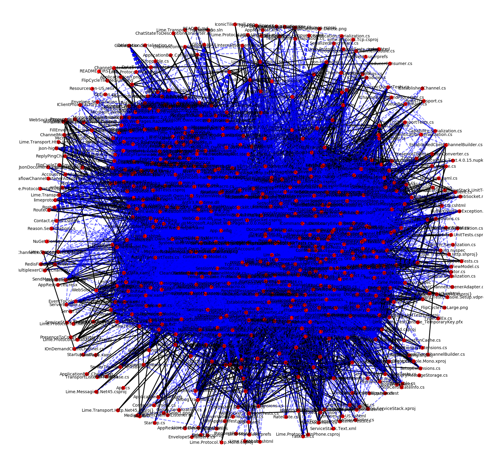
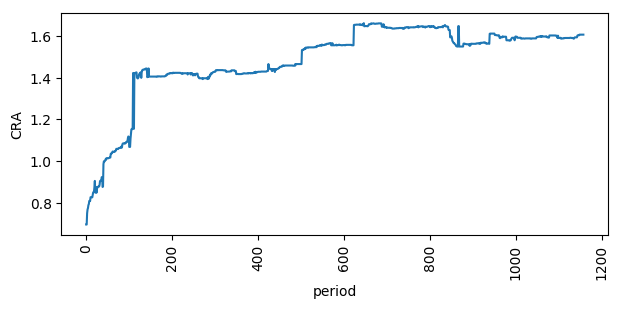
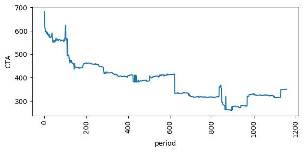
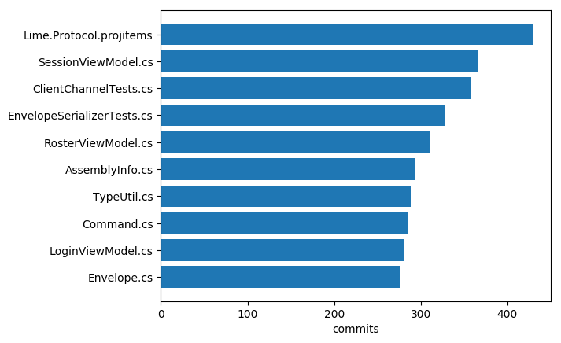

# lime-csharp
## Basics
### Total commits: 1159

### Commits by time:

### Top committers:

---
## Advanced Metrics
### Most modified files:

### Highest couplings
_Coupling means that the files have been modified together frequently_

### Average CRA
CRA stands for *Relative File Complexity*

### Average CTA
CTA stands for *Total File Complexity*

### Average MCA
MCA stands for *Biggest file complexity*

### Most "important" files

